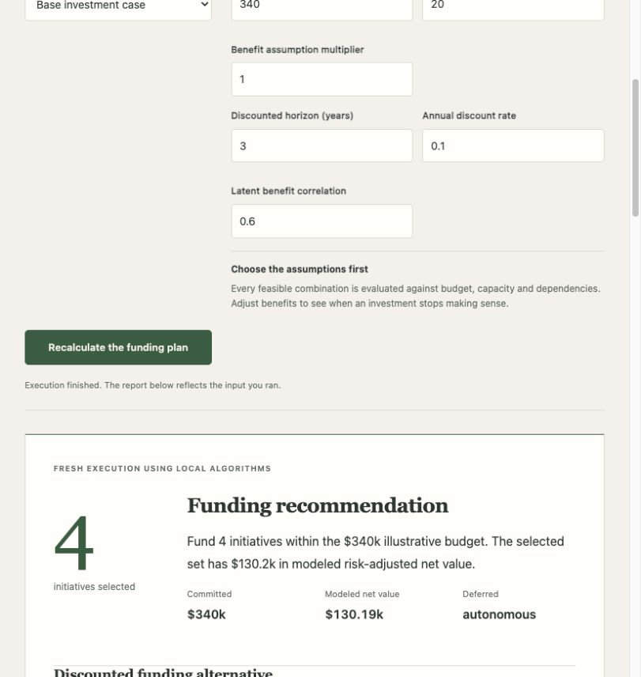

# AI Investment Planner



A funding workspace for exact initiative selection, discounted alternatives and evidence-bound delivery stages.

[Open application](https://Snuthakki21.github.io/ai-investment-planner/) · [Architecture](docs/ARCHITECTURE.md) · [Domain contracts](docs/DOMAIN_CONTRACTS.md) · [Runbook](docs/PRODUCT_RUNBOOK.md) · [Tests](tests)

[](https://github.com/Snuthakki21/ai-investment-planner/actions/workflows/ci.yml)

An attractive AI initiative can consume the same capacity as a better alternative, depend on an unfunded foundation, double-count another team's savings or fail to justify the next funding tranche. This application makes those constraints and assumptions explicit. Its exact solver, separate discounted objective, overlap policy and stage-evidence workflow give a funding committee a reproducible decision record.

## Start the application

Python 3.11 or later is supported. From a source checkout:

```sh
python3 -m portfolio serve
```

Open `http://127.0.0.1:8765`. Load the base case, adjust budget/capacity and compare the one-year net-value selection with the discounted alternative. Use the staged-evidence example to inspect accepted and missing funding gates.

```sh
python3 -m portfolio run ai_investment_planner --input examples/base.json --output reports/funding.json
python3 -m unittest discover -s tests -v
```

The public browser app runs the same Python product code in a worker. Browser workspace data stays in the current browser; the native workspace stores scenarios, revisions, execution history and reviews in local SQLite. Neither mode implies a shared authenticated cloud deployment. See [Running](docs/RUNNING.md) and [Model integration](docs/MODEL_INTEGRATION.md).

## Funding workflows

### 1. Select a feasible investment set

Enter initiative cost, delivery effort, annual benefit, confidence, risk, dependencies and accountable owner. The exact solver evaluates every feasible set of up to sixteen initiatives. Budget, person-month capacity and dependencies are hard constraints. The legacy objective is adjusted one-year benefit minus one-time implementation cost; no funding is selected when every feasible net value is nonpositive.

The solver compares Decimal values before rounding. This matters when two plans differ by a fraction or sit exactly on a budget boundary. Equal positive value favors lower cost. Delivery waves explain dependency order; they do not imply a calendar schedule.

### 2. Compare a discounted objective

Define the horizon, discount rate, annual benefit growth and annual operating-cost fraction. A separate optimizer discounts year-end net cash flows and subtracts time-zero implementation cost. Inspect its selected set, annual cash-flow rows and the legacy selection's NPV under the same assumptions.

The report preserves both objectives. A multi-year NPV decision must not be presented as if it were the original one-year adjusted net-value decision. Values are fictional planning assumptions, not observed ROI.

### 3. Control overlapping benefits

Define named groups of initiatives sharing a benefit. The policy deducts `overlap_fraction × (sum of selected group benefits − largest selected group benefit)`. At 100% overlap, only the largest shared benefit survives; at zero overlap, all selected benefits remain additive. A single selected member is unaffected.

An initiative may belong to only one overlap group, avoiding ambiguous repeated deductions. Overlap affects the discounted alternative and its sensitivity analysis; the original additive objective remains visible for comparison.

### 4. Release a modeled tranche against current evidence

Discovery, pilot and scale represent 10%, 30% and 60% of an initiative's implementation cost. Each gate requires a metric, observed result, target, comparison operator, source reference and reviewer label. Evidence binds to a SHA-256 revision of the funding assumptions. A changed budget, initiative, valuation assumption or overlap policy invalidates old evidence.

Stages cannot be skipped. Dependencies must reach the same stage before a dependent initiative does. Missing, stale, failing and out-of-sequence evidence produces explicit gate statuses. Only accepted evidence contributes to modeled eligible funding. Reviewer labels are supplied scenario data, not authenticated approvals; the application moves no money.

### 5. Examine correlated benefits and regret

Use a seeded Gaussian common factor to perturb initiative benefits, with bounded nonnegative multipliers. Compare the original selection, discounted selection, no funding and the top eight base-NPV feasible sets. The report shows mean scenario NPV, P10/P90 and mean regret relative to that displayed candidate set.

This is synthetic scenario sensitivity. It is neither a calibrated probability forecast nor an exhaustive hindsight optimum for every draw. The older independent triangular spread remains separately labeled, so correlation assumptions cannot be confused.

### 6. Draft a bounded decision brief

A configured native model can explain calculated selection, sensitivity and owners. The model receives person-month effort rather than calendar duration, cannot modify the solver and is instructed not to invent financial facts. Schema validation controls output shape; prose still needs review.

## Application structure

| Component | Responsibility |
|---|---|
| [`app/domain/validation.py`](app/domain/validation.py) | Input validation, identifier/dependency checks and cycle detection. |
| [`app/domain/optimization.py`](app/domain/optimization.py) | Typed Initiative and FeasiblePortfolio entities; FeasibleSet enumeration and ExactOptimizer. |
| [`app/domain/valuation.py`](app/domain/valuation.py) | DiscountAssumptions cash flows, BenefitOverlap entities and OverlapPolicy. |
| [`app/domain/funding.py`](app/domain/funding.py) | FundingEvidence, assumption revision and sequential/dependency stage gates. |
| [`app/domain/analysis.py`](app/domain/analysis.py) | Discounted selection, correlated sensitivity and finite-candidate expected regret. |
| [`app/domain/sensitivity.py`](app/domain/sensitivity.py) | Legacy independent-benefit spread and dependency delivery waves. |
| [`app/ai/brief.py`](app/ai/brief.py) | Optional explanation over calculated facts. |
| [`app/application/product.py`](app/application/product.py) | ProductApplication orchestrates validation, objectives, evidence and reports. |
| `app/platform/` | Scenario persistence, optimistic versions, run history, comparisons and review audit. |
| `projects/ai_investment_planner/project.py` | Public compatibility adapter and original synthetic scenarios. |
| `web/templates/ai_investment_planner.js` | Funding memo, discounted cash flows, stage gates and sensitivity views. |

## Input contract

| Field | Boundaries |
|---|---|
| `budget_k` | Nonnegative budget in assumed USD thousands. |
| `capacity_months` | Nonnegative person-month capacity; not calendar duration. |
| `benefit_factor` | Multiplier from 0 to 3. |
| `initiatives` | 1–16 uniquely identified items; acyclic known dependencies, nonnegative cost/effort/benefit and confidence/risk in [0,1]. |
| `discounted_cash_flow` | `horizon_years` 1–10, `discount_rate` 0–1, `annual_benefit_growth` −0.5–0.5, `annual_operating_cost_fraction` 0–1. |
| `benefit_overlaps` | Named groups with at least two unique known members and `overlap_fraction` 0–1; groups cannot share members. |
| `stage_evidence` | At most 48 records with the documented gate, revision, criterion, source and reviewer fields. |
| `correlated_sensitivity` | 20–500 paths, correlation 0–1 and spread 0–1. |
| `seed` | Integer controlling reproducible illustrative draws. |

Reports contain summary, metrics, evidence, next actions, legacy selection, discounted selection, cash flows, gate statuses, assumption digest and sensitivity results. Downloaded JSON contains the complete result even where the UI displays a bounded preview. New assumptions are validated before optional model calls.

## Verification

- [`test_ai_investment_planner.py`](tests/test_ai_investment_planner.py): feasibility, known optimum, nonpositive value, cycle/unknown dependencies, invalid numbers and reproducibility.
- [`test_ai_investment_planner_independent.py`](tests/test_ai_investment_planner_independent.py): exact decimal boundary and incumbent regressions, fractional frontier consistency and narrative person-month units.
- [`test_investment_product.py`](tests/test_investment_product.py): independent NPV arithmetic, overlap deductions, current/stale evidence, dependency gates, full tranches, correlated regret and invalid option boundaries.
- Shared platform/runtime tests exercise persistence, API, packaging and browser interactions separately.

```sh
python3 -m venv .venv
.venv/bin/python -m pip install -r requirements-dev.txt
.venv/bin/python -m coverage run -m unittest discover -s tests -v
.venv/bin/python -m coverage report
python3 -m portfolio build --output dist
node --test tests/frontend.test.mjs
```

Historical review reports apply to their recorded source revisions. Expanded-source review and current CI evidence must be evaluated independently. Coverage is not a guarantee of financial correctness or production readiness.

## Operating boundaries

All examples and financial inputs are original synthetic assumptions. The application does not observe realized savings, provide a security recommendation, approve real funding, execute financial transactions or certify accounting/regulatory compliance. Person-month capacity is not a staffing calendar. Benefits and risks require accountable business validation before a real investment decision.

The local native deployment is a single-operator workspace. Public Pages is client-side execution. Identity-backed multi-user approval, external evidence verification and enterprise procurement/accounting integrations are not claimed.

See [Architecture](docs/ARCHITECTURE.md), [Domain contracts](docs/DOMAIN_CONTRACTS.md), [Runbook](docs/PRODUCT_RUNBOOK.md), [Requirements](docs/REQUIREMENTS.md), [Security](SECURITY.md) and [Third-party notices](docs/THIRD_PARTY.md).

## Persistent workspace

The interface includes a versioned scenario library, execution history, exact input/result replay, outcome comparison and evidence reviews. GitHub Pages persists records in this browser; the native server uses SQLite with optimistic revisions, idempotent execution reservations and a verifiable audit chain. Application and workspace data remain independent of every other repository.

See [workspace workflows, installation, container, backup and recovery](docs/WORKSPACE.md), [HTTP API contracts](docs/API.md), [domain Staff Engineer review](docs/STAFF_REVIEW_V2.md), [platform Staff Engineer review](docs/STAFF_PLATFORM_REVIEW.md), and [measured validation](docs/VALIDATION.md).
