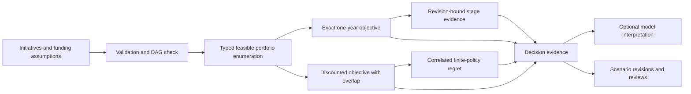

# Investment application architecture

## ADR-01: Exact bounded optimization

The supported domain contains at most sixteen initiatives. FeasibleSet enumerates dependency-closed combinations with Decimal budget and capacity checks. ExactOptimizer retains precise incumbent comparisons and rounds only report values. This avoids a solver dependency and makes every accepted set inspectable. Complexity is exponential in the documented bounded input; increasing the bound requires a different optimization strategy and performance evidence.

## ADR-02: Keep the original and discounted objectives separate

The one-year objective adjusts annual benefit by confidence and risk and subtracts one-time cost. DiscountAssumptions adds explicit year-end growth, discounting and annual operating costs. The two selections remain separate output fields so a change in valuation semantics cannot silently rewrite the original decision.

## ADR-03: Model benefit overlap explicitly

OverlapPolicy reduces additive benefit by a declared fraction of the smaller selected contributions in each group. Groups cannot share initiatives. This is an inspectable overlap assumption, not an estimate learned from observed outcomes. Only the discounted analysis applies this policy; the original additive selection remains visible.

## ADR-04: Bind funding evidence to assumptions

FundingEvidence contains the current assumption revision, a measurable criterion and source/reviewer labels. FundingPolicy orders selected initiatives by dependencies and evaluates discovery, pilot and scale sequentially. Evidence cannot skip a prior stage or advance ahead of a dependency. Revisions exclude their own evidence to avoid a circular digest. Reviewer labels do not imply identity verification.

## ADR-05: Evaluate a finite set under correlated sensitivity

InvestmentAnalysis perturbs benefits with seeded common-factor draws and evaluates a documented candidate set. Exact Decimal valuation is preserved after rounded scenario multipliers are converted into Decimal. Reported expected regret is relative to the displayed candidate policies. It is not falsely labeled a globally optimized decision for every future scenario.

## ADR-06: Keep model narrative outside the trusted calculation

InvestmentBrief receives calculated selection and sensitivity with explicit person-month effort. It cannot alter optimization, funding eligibility or stored review state. Structured output and provider boundaries come from the runtime; factual prose still requires human review.

## State boundary

ProductApplication coordinates pure calculations. app/platform owns scenario revisions, execution records and review audit. Browser and native workspaces are separate persistence environments. An execution report is evidence for a review, not an authenticated approval of a financial action.
