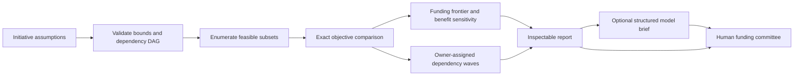

# AI Investment Planner

A funding committee workbook that selects a feasible set of initiatives, shows why each was chosen, and exposes when a change in assumptions would change the decision.

**The business problem:** an attractive AI proposal can consume capacity needed by a more valuable dependency, and a high headline benefit can disappear after uncertainty is considered. A ranked list alone cannot solve this problem because initiatives depend on one another.

**What runs here:** an exact, bounded portfolio optimizer; a dependency-aware delivery sequence; benefit sensitivity; a funding frontier; an illustrative spread of outcomes; and an optional model-generated committee brief. All input assumptions are original and fictional. The application does not present them as realized savings, an employer result, or a financial valuation.

[Open the funding workbook](https://Snuthakki21.github.io/ai-investment-planner/) · [Source](projects/ai_investment_planner/project.py) · [Independent automated Staff Engineer review](projects/ai_investment_planner/independent-staff-review.md)

## A two-minute walkthrough

1. Open the workbook and run **Base investment case**. Five proposals compete for a $340k budget and 20 person-months of capacity.
2. Inspect the selected initiatives and dependency waves. The data foundation enables downstream projects even though its individual return is modest.
3. Load **Tighter budget**. The optimizer recomputes the feasible combinations rather than truncating a ranked list.
4. Load **Benefits fall by half**. An empty recommendation is a valid outcome when no feasible set has positive adjusted net value.
5. Change the budget, capacity, or benefit multiplier and rerun. Download the report to retain the inputs' fingerprint and computed evidence.

The public page runs the same Python code in a browser worker. It requires no account or model key. Advanced users can load a JSON input file or edit the full initiative list.

## What this demonstrates

| Engineering responsibility | Inspectable evidence |
| --- | --- |
| Principal: choose the right decision mechanism | Exact enumeration with explicit constraints, deterministic tie handling, and a hard 16-initiative bound. A model does not decide the funding allocation. |
| Principal: preserve numerical correctness | Decimal arithmetic for feasibility and objective comparisons; adversarial regressions for fractional budgets and nearly equal returns. |
| Principal: manage trust boundaries | Optional model text receives computed selection evidence and must satisfy a closed output schema. It has no execution authority. |
| Director: connect spend to delivery | Budget, person-month capacity, dependencies, owners, and validation milestones appear in one reviewable plan. |
| Director: test assumptions before committing | Funding-frontier and benefit-sensitivity results show where the recommendation changes. |

These are capabilities demonstrated by this repository. They are not claims that this particular solution was deployed at a previous employer.

## Run locally

Python 3.11 or newer is sufficient for the application. There are no third-party Python runtime dependencies.

```sh
python -m portfolio run ai_investment_planner
python -m portfolio serve --port 8765
```

Open `http://127.0.0.1:8765`. To use your own inputs and retain the result:

```sh
python -m portfolio run ai_investment_planner --input examples/base.json --output run-result.json
```

The standalone repository includes `examples/base.json` and two alternative scenarios. The application is stateless: the input file and downloaded report are the durable artifacts. See [running and deployment](docs/RUNNING.md) for the CLI, browser build, and MCP interface.

## Decision model

For each initiative:

```text
adjusted benefit = annual benefit assumption × benefit multiplier × confidence × (1 − risk)
net value        = total adjusted benefit − total implementation cost
```

A selected set must satisfy all of the following:

- Total implementation cost does not exceed the budget.
- Total person-month effort does not exceed capacity.
- Every selected initiative's dependencies are also selected.
- The dependency graph has no cycles or unknown identifiers.

The solver enumerates all nonempty subsets, retains the feasible set with greatest positive net value, and prefers lower implementation cost on an exact tie. The empty set is the starting incumbent. If both objective and cost tie, input order determines the stable choice; the application makes no claim of fairness between equivalent proposals.

Inputs are converted with `Decimal(str(value))` before optimization. Comparisons use full computed precision; presentation rounds benefits and net value to six decimal places. Capacity is an effort constraint, not a staffing calendar or delivery-date forecast.

The benefit-sensitivity table evaluates multipliers 0.5, 0.75, 1.0 and 1.25. The funding frontier evaluates 50%, 75%, 100% and 125% of the supplied budget. Each row resolves the portfolio again. Five hundred seeded triangular draws illustrate uncertainty for the selected set; they assume independent benefits and are **not** calibrated confidence intervals.

## Architecture and boundaries



| Decision | Reason | Revisit when |
| --- | --- | --- |
| Exact enumeration instead of an agent or solver service | At 16 initiatives the search is bounded and every choice can be independently checked. There is no model-induced allocation drift. | Larger portfolios or multidimensional constraints justify a tested MILP formulation. |
| Deterministic calculation before optional generation | Narrative can clarify a decision without becoming its source of truth. | Never delegate the arithmetic or constraint acceptance to prose generation. |
| Repository-local fixtures and browser execution | A reviewer can reproduce the example without cloud access or credentials. | A real organization needs authenticated data ingestion, signed assumption approvals, and controlled persistence. |
| No automatic funding action | Selection is advice for a review process; the program has no purchasing or deployment integration. | Any future action adapter would need separate authorization and an audit trail. |

## Input contract

| Field | Meaning and validation |
| --- | --- |
| `budget_k` | Finite number from 0 to 100,000; fictional budget in thousands of dollars. |
| `capacity_months` | Finite number from 0 to 100,000; total person-month effort available. |
| `benefit_factor` | Finite number from 0 to 3; common multiplier applied to benefits. |
| `seed` | Optional integer, default 21; controls the illustrative outcome spread. Booleans are rejected. |
| `initiatives` | Between 1 and 16 objects. |
| `id`, `name`, `owner` | Nonempty strings of at most 100 characters; identifiers must be unique. |
| `cost_k`, `months`, `benefit_k` | Finite numbers from 0 to 100,000 per initiative. |
| `confidence`, `risk` | Finite fractions in [0, 1]. These are user assumptions, not inferred probabilities. |
| `depends_on` | Array of existing initiative identifiers; cycles and self-dependencies fail validation. |

The shared execution boundary caps the JSON input at 256 KB and rejects non-finite values. Invalid inputs produce a clear error; an earlier browser result remains visible until a new run succeeds. No automatic repair silently changes business assumptions.

## Output contract

The JSON report contains `summary`, `metrics`, `evidence`, `next_actions`, `details`, and execution `provenance`.

`details.selection` contains chosen IDs, cost, effort, adjusted benefit and net value. `selected_initiatives` retains the corresponding assumptions. `deferred` lists unselected IDs. `budget_frontier`, `benefit_sensitivity`, `dependency_waves`, and `illustrative_net_value_spread_k` provide review evidence. `model_brief` is null in local mode.

Provenance records execution time, input and source SHA-256, execution mode, and model-call metadata. A hash makes changes detectable when compared with a trusted copy; it is not an immutable or signed audit record.

## Optional AI integration

A configured provider may generate three fields: `brief`, `assumption`, and `validation_milestone`. The prompt includes computed selection, sensitivity results and ownership waves. The model may not rewrite the allocation. Its text remains a draft for human review because schema validity alone cannot prove that prose is supported.

```sh
AI_PROVIDER=ollama AI_MODEL=your-installed-model python -m portfolio run ai_investment_planner --mode live
```

For an OpenAI-compatible endpoint, configure `AI_MODEL`, `AI_API_KEY` and, when needed, `AI_BASE_URL`. Keep secrets out of the repository and browser. See [model integration](docs/MODEL_INTEGRATION.md) for limits, failure handling and actual validation evidence.

## Tests and independent review

```sh
python -m unittest discover -s tests -v
python -m pip install -r requirements-dev.txt
python -m coverage run --branch --source=portfolio,projects -m unittest discover -s tests
python -m coverage report
python -m portfolio build --output dist
node --test tests/frontend.test.mjs
```

Tests cover feasible optimal selection, dependency closure, empty recommendations, budget and capacity ceilings, cycles, unknown dependencies, reproducibility, input validation, and structured-model behavior. Independent reviewer regressions specifically cover two almost equal investment values and a `0.1 + 0.2` budget boundary. The audit initially found those defects and invalid-root handling; the implementation was corrected and independently retested.

Read the [independent review](projects/ai_investment_planner/independent-staff-review.md) for its actual scope, source hashes, findings, and limitations. This is an automated engineering review, not certification by an external human firm. Coverage is evidence of executed paths; it does not establish that all possible business assumptions are correct.

## Operating model and adoption gates

The business sponsor owns benefit assumptions; engineering owns cost, dependencies and effort; finance reviews the units and time horizon. Before a funding decision, each owner should identify a measured baseline, an acceptance threshold, a budget release milestone and a stop condition.

Re-run after a material assumption changes. Retain both input and report, explain changes in selection, and compare realized measurements with the original assumptions. Do not treat independent triangular draws as a model of correlated organizational failure.

Production adoption would require evidence approval, identity-based access, retention policy, change control, correlated scenarios and benefits accounting. Those integrations are deliberately outside the bounded functionality implemented here. See [operating model](docs/OPERATING_MODEL.md).

## Limitations worth discussing in an interview

- Annual assumed benefits and one-time implementation costs are compared without discounting or multiyear cash flow.
- Overlapping benefits are not automatically detected. Sponsors must remove double counting.
- Risk and confidence may encode the same uncertainty twice; the workbook exposes both assumptions rather than claiming they are calibrated.
- Enumeration is exponential and intentionally limited to 16 proposals.
- Dependency waves indicate ordering only, without resource-level scheduling or calendar commitments.
- Model text is optional; the core solution is complete and reproducible with no model connection.

## Authorship and license

Seshu Nuthakki. Original synthetic examples. MIT license; vendored browser-runtime components retain their own notices in `web/vendor/pyodide`.
